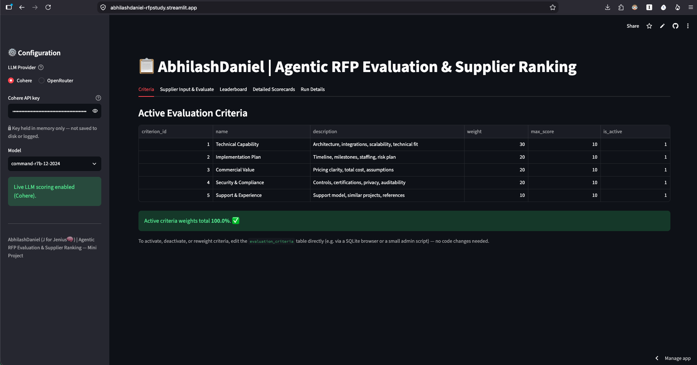
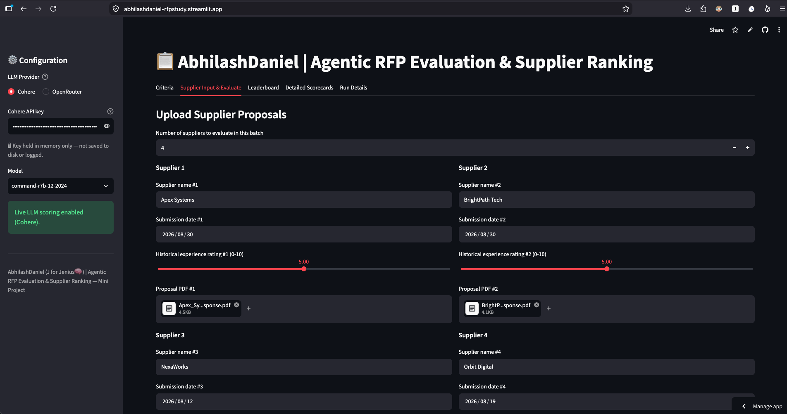
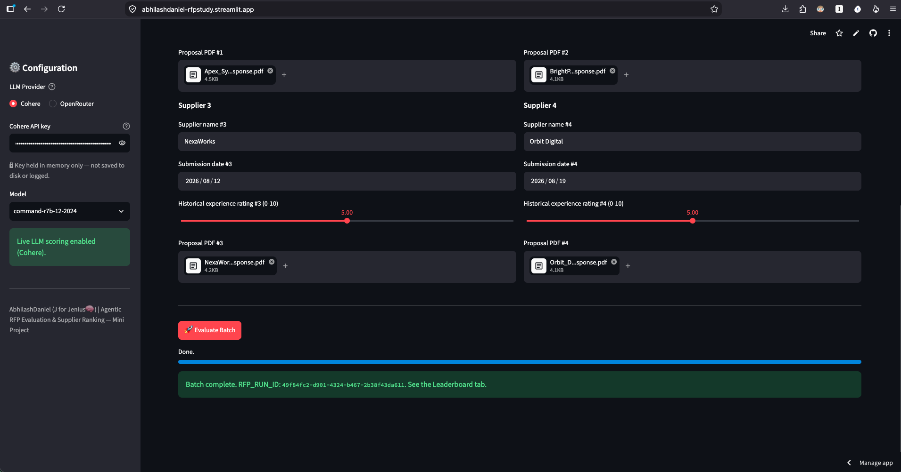
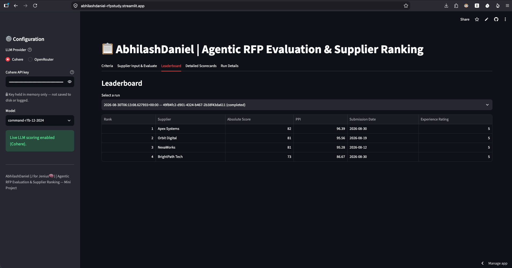
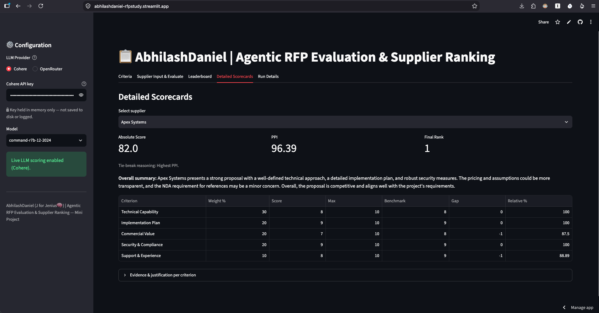
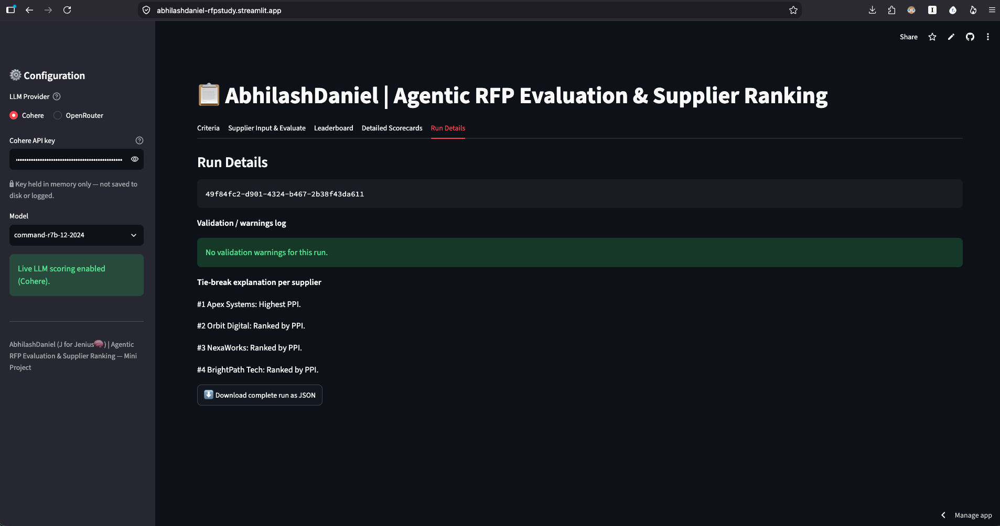

# AbhilashDaniel | Agentic RFP Evaluation & Supplier Ranking

🚀 **Live app:** [abhilashdaniel-rfpstudy.streamlit.app](https://abhilashdaniel-rfpstudy.streamlit.app/)

An AI-assisted Streamlit application that reads supplier RFP proposals (PDFs), scores
them against configurable weighted criteria using an LLM, benchmarks suppliers against
their peers with **deterministic Python**, and produces an explainable, reproducible
leaderboard.

> **Design principle (non-negotiable):** the LLM only ever judges proposal *content*
> (scores + justification + evidence per criterion). It never computes weighted totals,
> benchmarks, tie-breaks, or final rank — that arithmetic lives entirely in
> `tools/validation_tool.py` and `tools/ranking_tool.py`, so the same inputs always
> produce the same final ordering.

---

## 1. Architecture

| Component | Responsibility | Where |
|---|---|---|
| **Orchestrator Agent** | Controls the workflow and calls each tool in order | `orchestrator.py` |
| **Document Tool** | Extracts clean text from each uploaded PDF | `tools/document_tool.py` (PyMuPDF) |
| **Evaluation Agent** | Builds an evidence-grounded prompt and gets one JSON scorecard per supplier | `tools/evaluation_agent.py` + `utils/llm_client.py` (Cohere / OpenRouter) |
| **Validation Tool** | Schema-checks the LLM output, fills missing criteria, clips out-of-range scores, logs warnings | `tools/validation_tool.py` |
| **Ranking Tool** | Absolute weighted score, peer benchmarks, gaps, relative %, PPI, deterministic tie-break ranking | `tools/ranking_tool.py` |
| **Repository / DB** | SQLite persistence for criteria, runs, and results | `db/repository.py`, `db/init_db.py`, `db/schema.sql` |
| **Streamlit UI** | Criteria view, upload + evaluate, leaderboard, scorecards, run details + JSON export | `app.py` |

### Data flow (per brief section 4)

```
Setup → Input → Batch → Evaluate → Validate → Score → Benchmark → Rank → Persist → Present
```

1. **Setup** — Streamlit starts; active criteria are loaded from SQLite (Criteria tab).
2. **Input** — user uploads supplier PDFs + enters supplier name, submission date, and
   historical experience rating (Supplier Input tab).
3. **Batch** — clicking "Evaluate Batch" creates one `rfp_run_id` (UUID) for the whole batch.
4. **Evaluate** — for each supplier: extract PDF text → build a grounded prompt from the
   *currently active* criteria → call the LLM → get back one JSON scorecard.
5. **Validate** — deterministic Python checks the scorecard has one entry per active
   criterion, clips any score outside `[0, max_score]`, defaults missing criteria to 0,
   and records every correction as a warning.
6. **Score** — absolute weighted score computed in Python (see formulas below).
7. **Benchmark** — best score per criterion across all suppliers in the batch; gap and
   relative % computed per supplier per criterion.
8. **Rank** — weighted Peer Performance Index (PPI) computed, then suppliers are sorted
   with the mandatory tie-break order and assigned sequential ranks.
9. **Persist** — every supplier's full result (including warnings, evidence, tie-break
   reasoning) is written to SQLite under the single `rfp_run_id`.
10. **Present** — Leaderboard, Detailed Scorecards, and Run Details tabs read straight
    from SQLite; the full run can be downloaded as JSON.

---

## 2. Formulas

For each supplier and criterion `c` with weight `w_c` (%) and max score `m_c`:

- **Absolute weighted score** (0–100 scale):
  `sum over c of (score_c / m_c) * w_c`

- **Criterion benchmark**: the highest valid score observed for that criterion across
  every supplier in the batch.

- **Criterion gap**: `score_c − benchmark_c` (zero for whoever leads that criterion,
  negative otherwise).

- **Relative performance %**: `(score_c / benchmark_c) * 100`.
  *Safe-zero handling*: if the benchmark for a criterion is `0` (no supplier scored above
  zero on it), relative % is defined as `100%` for every supplier on that criterion, so a
  single degenerate criterion can't divide-by-zero or unfairly zero out the PPI.

- **Peer Performance Index (PPI)**: weighted average of each criterion's relative %,
  i.e. `sum over c of relative_pct_c * (w_c / 100)`.

- **Mandatory tie-break order** (applied as a single stable sort, then ranks 1..N are
  assigned):
  1. Higher PPI first
  2. Earlier submission date
  3. Higher historical experience rating
  4. Supplier name, ascending (A→Z)

---

## 3. Database (SQLite)

`db/schema.sql` defines three tables (minimum fields from the brief, section 6):

- `evaluation_criteria (criterion_id, name, description, weight, max_score, is_active)`
- `rfp_runs (rfp_run_id, created_at, status)`
- `supplier_results (rfp_run_id, supplier_name, submission_date, experience_rating, absolute_score, ppi, final_rank, result_json)`

`result_json` stores the complete per-supplier detail (per-criterion score, benchmark,
gap, relative %, evidence, justification, warnings, tie-break reasoning) so every number
shown in the UI is traceable back to a stored record, not recomputed on the fly.

**Reconfiguring criteria without touching code:** activate/deactivate criteria or change
weights by editing rows in `evaluation_criteria` directly (e.g. with the `sqlite3` CLI,
DB Browser for SQLite, or a small admin script). The next batch you run will
automatically reload whatever is active at that moment (Setup → Evaluate steps always
re-query the DB).

---

## 4. LLM layer

`utils/llm_client.py` routes scoring calls to one of two active providers, selected via
the `RFP_LLM_PROVIDER` environment variable (default: `cohere`):

| Provider | Env var | Default model | Notes |
|---|---|---|---|
| **Cohere** *(default)* | `COHERE_API_KEY` | `command-r7b-12-2024` | Native SDK (`cohere>=5.0.0`) |
| **OpenRouter** | `OPENROUTER_API_KEY` | `google/gemini-2.0-flash-001` | OpenAI-compatible REST, no extra SDK |
| ~~Anthropic~~ | ~~`ANTHROPIC_API_KEY`~~ | ~~deprecated~~ | Emits `DeprecationWarning`; use OpenRouter instead |

The LLM is asked for **JSON-only** output: one score + justification + evidence per active
criterion, plus a short risk list and overall summary. The prompt explicitly instructs the
model to use only evidence found in the proposal text.

**Offline / mock mode:** if no API key is set for the active provider, the app
automatically runs in a deterministic **mock mode** — it derives stable, repeatable
placeholder scores from a hash of each supplier + criterion so you can exercise the full
validation/scoring/ranking/persistence pipeline and demo the UI without an API key or
network access. This is clearly flagged in the sidebar and in every mock justification
string (prefixed `[MOCK]`). Switch to live scoring at any time by supplying a real key.

---

## 5. Setup

```bash
# 1. Clone/copy the project, then from the project root:
pip install -r requirements.txt

# 2. Generate the four synthetic supplier RFP PDFs (already included in data/sample_rfps/,
#    but you can regenerate them any time):
python generate_sample_pdfs.py

# 3. Create and seed the SQLite database (safe to re-run; use --reset to start clean):
python db/init_db.py

# 4. Run the app
streamlit run app.py
```

In the sidebar, select **Cohere** or **OpenRouter** as the provider and paste the
corresponding API key to enable live LLM scoring. Leave it blank to use offline mock mode.
You can also set the key via environment variable:

```bash
# Cohere (default provider)
export COHERE_API_KEY=...
streamlit run app.py

# OpenRouter
export RFP_LLM_PROVIDER=openrouter
export OPENROUTER_API_KEY=...
streamlit run app.py
```

### Deploying to Streamlit Community Cloud

1. Push this project to a public (or connected) GitHub repo.
2. On Streamlit Community Cloud, create a new app pointing at `app.py`.
3. Add the relevant API key under the app's **Secrets** (`.streamlit/secrets.toml` style):
   ```toml
   COHERE_API_KEY = "..."
   # or for OpenRouter:
   # OPENROUTER_API_KEY = "..."
   # RFP_LLM_PROVIDER = "openrouter"
   ```
4. Note: Streamlit Cloud's filesystem is ephemeral — the SQLite file will reset on
   redeploys/restarts. For a classroom submission this is fine (`db/init_db.py` logic
   runs automatically on first import), but it is not meant for durable production storage.

---

## 6. Repository structure

```
rfp_project/
├── app.py                       # Streamlit UI (5 screens)
├── orchestrator.py               # Orchestrator agent: sequences all tools
├── generate_sample_pdfs.py       # Builds the 4 synthetic supplier PDFs
├── requirements.txt
├── README.md
├── db/
│   ├── schema.sql                 # Table definitions
│   ├── init_db.py                 # Create + seed default criteria
│   ├── repository.py              # All SQL access lives here
│   └── rfp_evaluation.db          # Created on first run
├── tools/
│   ├── document_tool.py           # PDF → text (PyMuPDF)
│   ├── evaluation_agent.py        # Builds prompt, calls LLM
│   ├── validation_tool.py         # Schema checks, clipping, warnings
│   └── ranking_tool.py            # Scoring, benchmarking, PPI, tie-breaks
├── utils/
│   └── llm_client.py              # Multi-provider LLM client (Cohere / OpenRouter) + mock mode
├── data/
│   └── sample_rfps/               # 4 synthetic supplier PDFs
├── docs/
│   └── screenshots/               # UI screenshots (per run)
└── sample_output/
    └── rfp_run_49f84fc2-....json  # Sample completed RFP run export
```

---

## 7. Assumptions

- Active criteria weights are expected to total 100%; if they don't, the app still runs
  but surfaces a visible warning in both the Criteria tab and the Run Details warnings
  log, since scoring against misconfigured weights is still deterministic and traceable
  — just flagged.
- Submission dates are entered via a date picker (ISO `YYYY-MM-DD`), so tie-break date
  comparison is unambiguous.
- Proposal text is truncated to ~15,000 characters per document before prompting, which
  comfortably covers the 2–4 page synthetic proposals used here; very long real-world
  RFPs would need a chunking strategy.
- "Historical experience rating" is entered by the user per batch (0–10 scale) rather
  than looked up from a separate supplier master table, per the minimum requirements.
- Mock mode is a *testing/demo convenience*, not a scoring method — its outputs are
  clearly labeled `[MOCK]` throughout the UI and JSON export.

## 8. Testing notes / edge cases covered

- Missing criterion in the LLM's JSON → defaulted to score 0 with a warning.
- Out-of-range or non-numeric score → clipped/defaulted with a warning.
- Malformed / non-JSON LLM response → treated as empty result, fully logged.
- Benchmark of `0` for a criterion (safe-zero handling) → relative % defined as 100%
  rather than dividing by zero.
- Full PPI/date/experience/name tie-break chain is exercised in
  `tools/ranking_tool.py::rank_suppliers` and explained per-supplier in the UI.
- `sample_output/rfp_run_49f84fc2-d901-4324-b467-2b38f43da611.json` was generated by
  running the complete pipeline end-to-end against the four included synthetic PDFs
  (same run as the screenshots in section 9) — use it as a reference for the expected
  shape of a completed run, or as your "validation/error case" demo evidence alongside
  a live run.

---

## 9. Screenshots

> All screenshots and the sample JSON export above are from the same run:
> **`RFP_RUN_ID: 49f84fc2-d901-4324-b467-2b38f43da611`**

### Criteria tab


### Supplier Input & Evaluate tab



### Leaderboard tab


### Detailed Scorecards tab — Rank 1


### Run Details tab

